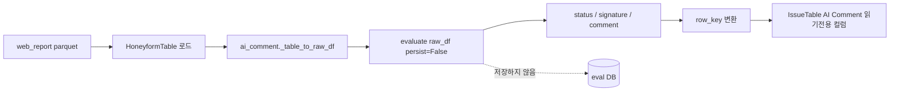
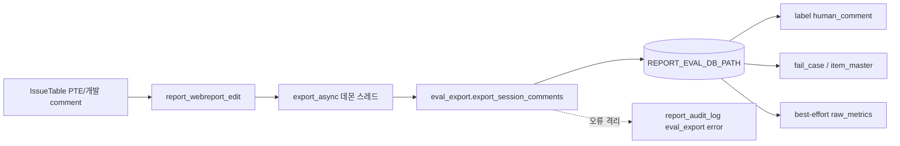
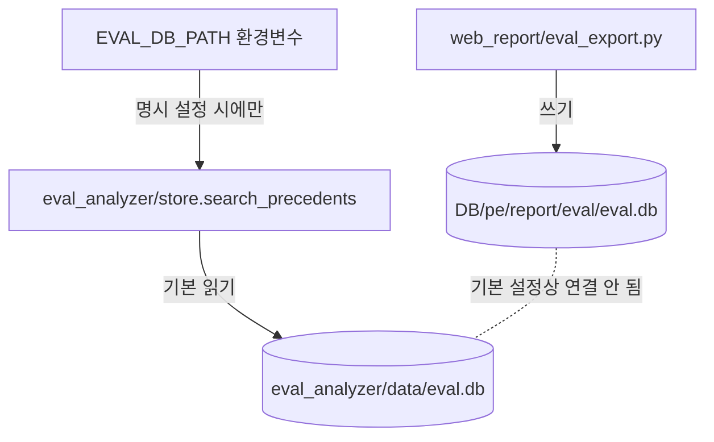
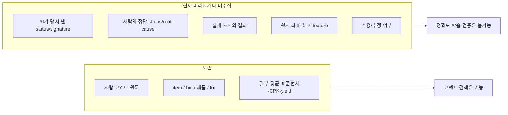
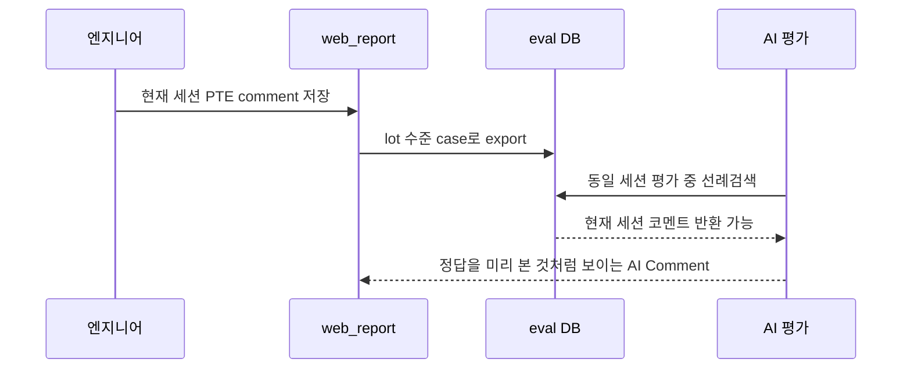
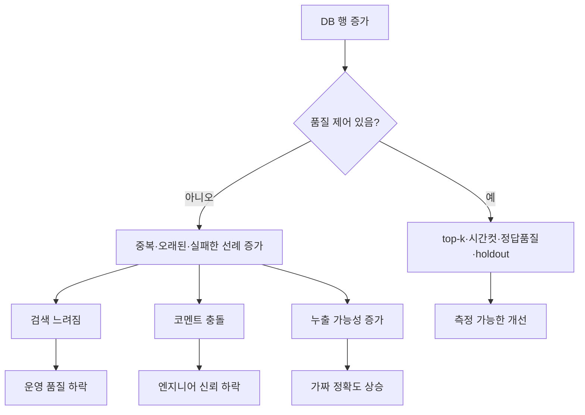
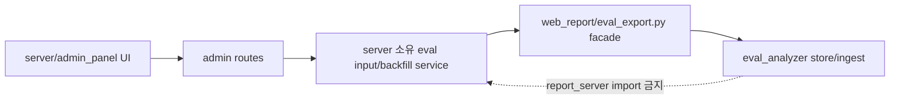
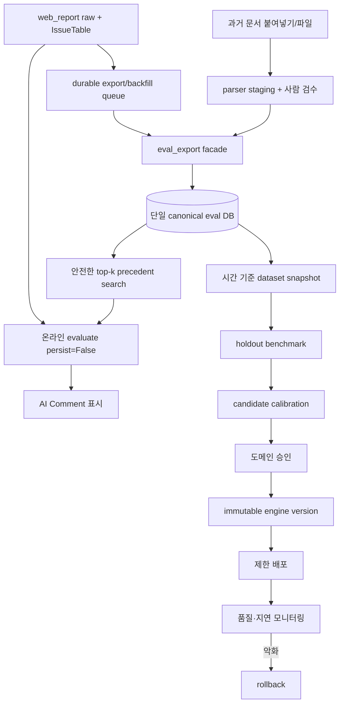
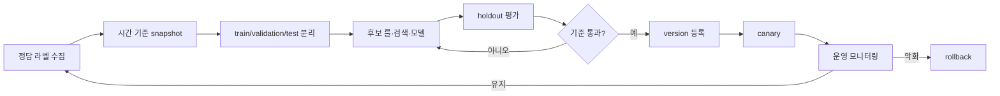
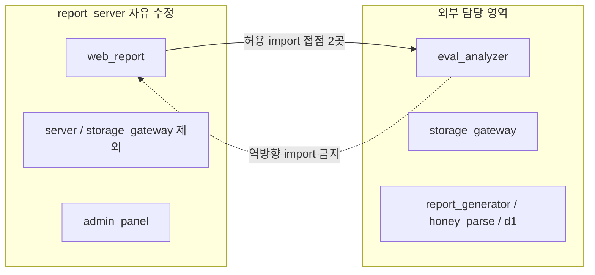

# web_report–eval_analyzer 학습 구조 상세 분석 보고서

> 기준일: 2026-07-17 (Asia/Seoul)  
> 대상 독자: 평가·분석 도메인 경력 약 5년, Python·서버 구축 경험 1년 미만  
> 조사 방식: 코드·설정·문서·SQLite를 읽기 전용으로 확인하고 현행 테스트를 실행  
> 변경 범위: 이 보고서와 동명의 HTML 보고서만 추가. 소스 코드·DB·설정·스키마는 변경하지 않음

---

## 0. 먼저 결론

### 0.1 한 문장 결론

현재 구조는 **web_report 데이터로 평가를 실행하는 길**과 **IssueTable 사람 코멘트를 별도 DB에 저장하는 길**은 만들어져 있지만, 두 길이 기본 설정에서 같은 DB로 이어지지 않고, AI 기능도 꺼져 있으며, 판정 정확도를 자동으로 학습·검증·배포하는 폐쇄 루프는 구현되어 있지 않다.

따라서 현재 상태를 “DB가 쌓일수록 평가분석엔진이 스스로 학습해 정확도가 계속 좋아지는 구조”라고 부르면 안 된다. 더 정확한 표현은 다음과 같다.

- 현재 가능한 것: 룰 기반 평가, 과거 코멘트 SQL 검색, 검색된 코멘트를 결과 문장에 붙이는 선례 활용
- 현재 불가능한 것: 자동 모델 학습, 자동 룰 개선, 정확도 향상 증명, 안전한 자동 배포·롤백
- 가장 먼저 할 일: **DB 경로 단일화 → 기존 코멘트 백필 → 자기 선례 누출 차단 → top-k/품질 필터 → 백업·재시도 → 정답 라벨 수집 → 시간 분리 검증**

### 0.2 쉬운 비유

이 시스템을 “검사실과 전문가의 사례 노트”로 생각하면 쉽다.

| 시스템 요소 | 쉬운 비유 | 실제 역할 |
|---|---|---|
| `web_report` | 검사 결과 접수창구 | 측정 raw/parquet를 받아 표·그래프·IssueTable 생성 |
| `eval_analyzer` | 판정 전문가 | 룰과 통계 feature로 status/signature/comment 생성 |
| eval DB | 전문가의 사례 노트 | 과거 case, 사람 코멘트, 조치·결과, 평가 결과 저장 |
| `eval_export.py` | 사례 노트를 대신 적는 기록 담당 | IssueTable PTE/개발 코멘트를 eval 스키마 DB로 복사 |
| `search_precedents()` | 비슷한 과거 페이지 찾기 | item명·value type·제품군으로 유사 선례 검색 |
| `calibrate.py` | 판정 기준표 재조정 | 누적 feature 분위수로 YAML 임계값 후보 생성 |

현재는 기록 담당자가 **서랍 B**에 코멘트를 쓰도록 되어 있고, 전문가는 기본적으로 **서랍 A**를 찾는다. 게다가 전문가 호출 스위치가 꺼져 있고, 전문가가 새로 계산한 feature·판정은 `persist=False`라 사례 노트에 기록하지 않는다. 이 상태에서는 사례가 많아져도 전문가의 판정 기준이 자동으로 좋아질 수 없다.

### 0.3 현재 상태 판정표

| 질문 | 현재 답 | 근거 |
|---|---|---|
| web_report raw로 평가를 호출할 수 있는가? | **예, 코드 경로 존재** | `web_report/ai_comment.py`가 Honeyform을 `raw_df`로 재조립해 `evaluate()` 호출 |
| 운영 UI에서 AI Comment를 쓸 수 있는가? | **아니오, 기본 UI 비활성** | `client/honey_main.py:632`의 `setEnabled(False)` |
| 사람 코멘트를 eval 스키마 DB에 저장하는가? | **예, 변경 이후 이벤트부터** | 업로드·코멘트 편집·ETC 편집에서 `export_async()` 호출 |
| 기존 코멘트를 자동 일괄 백필하는가? | **아니오** | 관리자 API는 세션 1건 재적재만 제공 |
| 평가 엔진이 export DB를 기본으로 읽는가? | **아니오** | 두 기본 DB 경로가 다름 |
| DB 증가가 status/signature를 자동 개선하는가? | **아니오** | 판정은 YAML 룰, 보정은 수동, 온라인 호출은 무기록 |
| DB 증가가 comment에 영향을 줄 수 있는가? | **조건부 예** | DB 경로가 연결되면 SQL 선례 코멘트를 모두 문장에 포함 |
| 정확도 향상을 측정할 수 있는가? | **현재는 불가** | precision/recall/F1/holdout 비교 코드와 충분한 정답 라벨 없음 |
| 운영 안정성이 충분한가? | **아니오** | 데몬 스레드 export, durable queue·eval DB 백업 없음 |

---

## 1. 조사 범위와 확인된 운영 데이터

### 1.1 읽은 주요 코드와 문서

- 통합 규약: [`docs/13_eval_analyzer_integration.md`](../../docs/13_eval_analyzer_integration.md)
- 소유권 정본: [`docs/15_ownership.md`](../../docs/15_ownership.md)
- AI 평가 브리지: [`web_report/ai_comment.py`](../../web_report/ai_comment.py)
- 사람 코멘트 export: [`web_report/eval_export.py`](../../web_report/eval_export.py)
- web_report 조회·편집 오케스트레이션: [`web_report/service.py`](../../web_report/service.py)
- 엔진 공개 진입점: [`eval_analyzer/eval_engine/api.py`](../../eval_analyzer/eval_engine/api.py)
- DB·선례검색: [`eval_analyzer/eval_engine/store.py`](../../eval_analyzer/eval_engine/store.py)
- 보정: [`eval_analyzer/eval_engine/calibrate.py`](../../eval_analyzer/eval_engine/calibrate.py)
- 수동 입력: [`eval_analyzer/db_input/import_csv.py`](../../eval_analyzer/db_input/import_csv.py), [`import_text.py`](../../eval_analyzer/db_input/import_text.py), [`ai_extract.py`](../../eval_analyzer/db_input/ai_extract.py)
- 관리자 Eval DB: [`server/admin_panel/eval_admin.py`](../../server/admin_panel/eval_admin.py), [`routes.py`](../../server/admin_panel/routes.py)

### 1.2 현재 `report.db` 읽기 전용 확인 결과

실제 코멘트 원문은 보고서에 기록하지 않았다. 건수·분류·시점만 확인했다.

| 항목 | 확인값 |
|---|---:|
| 전체 세션 | 46건 |
| web_report 세션 | 15건 |
| xlsx_upload 세션 | 31건 |
| AI Comment 옵션 활성 web_report 세션 | 0건 |
| `family_product`가 비어 있는 web_report 세션 | 15건 |
| IssueTable 코멘트 셀 | 3건 |
| 코멘트가 있는 세션 | 3건 |
| 코멘트 컬럼 | 모두 PTE comment |
| 코멘트 카테고리 | 모두 Yield |
| 코멘트 작성 시점 | 2026-07-11 22:30:45 ~ 2026-07-12 22:24:04 |
| 기본 경로의 report_server 소유 eval DB | 없음 |
| 기본 경로의 eval_analyzer 소유 eval DB | 없음 |
| `eval_export` 오류 감사로그 | 없음 |

코멘트 작성일은 코멘트 export 기능 문서상 도입일(2026-07-15)보다 앞선다. 따라서 “코멘트는 있는데 eval DB가 없는 현상”은 export 실패라기보다 **기능 도입 전 데이터가 자동 백필되지 않은 상태**로 해석하는 것이 가장 자연스럽다. 다만 실제 Windows 서비스가 다른 환경변수로 실행되었다면 별도 DB가 존재할 수 있으므로 운영 배포 환경에서 한 번 더 확인해야 한다.

### 1.3 테스트 결과

- `eval_analyzer`: **88 passed**
- `tests/test_eval_export.py`: **PASS**

이 결과는 다음을 의미한다.

- 스키마 생성, CRUD, 룰 발화, 입력 파싱, CSV/JSON 적재, 합성 데이터 E2E가 코드가 의도한 대로 동작한다.
- PTE+개발 코멘트 병합, 멱등 재적재, 코멘트 수정·삭제 reconciliation, `search_precedents(conn=...)` 조회 계약이 동작한다.

그러나 이 결과는 다음을 의미하지 않는다.

- 실제 엔지니어 정답 대비 status 정확도가 높다는 뜻이 아니다.
- DB가 늘어난 전후 precision/recall이 좋아졌다는 뜻이 아니다.
- 운영 프로세스 종료·동시 편집·대규모 DB·백업 복구를 검증했다는 뜻이 아니다.

즉 **기능 테스트는 통과하지만, 품질 검증은 아직 없다.**

---

## 2. 현행 데이터 흐름

### 2.1 AI Comment 생성 흐름



세부 동작:

1. `service.load_webreport()`가 세션의 `webreport_options.ai_comment`를 확인한다.
2. 옵션이 참인 콜드 빌드에서만 `ai_comment.safe_build()`를 호출한다.
3. Honeyform의 메타 6행과 측정 데이터를 엔진 정본 `raw_df` 형태로 재조립한다.
4. 소스별로 `evaluate({"meta": ..., "raw_df": raw_df}, persist=False)`를 호출한다.
5. `(item_raw, bin)`별 가장 심각한 case를 선택한다.
6. `Yield|bin|item`, `CPK|item`, `ETC|item` row key로 변환한다.
7. IssueTable의 읽기 전용 `AI Comment` 열에 `[status] comment`로 표시한다.

좋은 점:

- eval_analyzer가 report_server를 import하지 않는 단방향 의존을 지킨다.
- 평가 실패가 web_report 전체 조회를 죽이지 않는다.
- raw 편집으로 `content_hash`가 변하면 report 캐시가 바뀌어 다시 평가된다.
- AI Comment는 편집 가능 코멘트 목록에 포함되지 않아 사람이 실수로 덮어쓰지 못한다.

한계:

- `persist=False`라 평가 결과·feature·evidence·사용 선례가 DB에 남지 않는다.
- 현재 UI에서는 체크박스 자체가 비활성이다.
- 오류가 나도 빈 dict로 계속 진행하므로 사용자는 “정상적으로 빈 결과”와 “평가 실패”를 구별하기 어렵다.

### 2.2 사람 코멘트 export 흐름



트리거는 세 곳이다.

1. web_report 업로드 후 manifest 코멘트 시드 직후
2. IssueTable PTE/개발 코멘트 저장 후
3. ETC 항목 추가·삭제 후

적재되는 핵심 값:

- PTE와 개발 코멘트를 한 `human_comment`로 병합
- `labeler=web_report`, `label_quality=manual`
- 마지막 편집자를 reviewer로 저장
- row key에서 bin과 item 추출
- unit, LSL, USL, 평균·표준편차·CPK·yield를 best-effort로 계산
- 동일 세션 재적재 시 기존 run을 재사용하고 삭제된 코멘트를 정리

적재되지 않는 중요한 정답 값:

- `human_status`
- `root_cause_category`, `root_cause_detail`
- `engine_comment_accepted`, 실제 수정 여부
- `case_outcome.action`, `result`
- 평가 당시 엔진의 `eval_id`, engine version, model version

따라서 현재 export 데이터는 “과거 코멘트 문장 검색”에는 사용할 수 있지만, “엔진 판정이 맞았는지 학습·검증하는 정답셋”으로는 불충분하다.

### 2.3 기본 DB 경로가 갈라져 있다



| 주체 | 환경변수 | 기본값 |
|---|---|---|
| report_server 코멘트 export | `REPORT_EVAL_DB_PATH` | `<repo>/DB/pe/report/eval/eval.db` |
| eval_analyzer 선례검색·persist | `EVAL_DB_PATH` | `<repo>/eval_analyzer/data/eval.db` |

현재 셸과 기본 `server/start.bat`에는 둘을 같은 값으로 설정하는 코드가 없다. 그러므로 **코드 기본값 기준으로는 사람이 쓴 코멘트가 평가 엔진의 선례검색에 사용되지 않는다.**

주의: 서비스 관리자나 Windows 서비스 환경에서 `EVAL_DB_PATH`를 별도로 설정했다면 실제 운영에서는 연결되어 있을 수 있다. 서버 시작 로그나 `/api/eval/health` 같은 점검 API가 없기 때문에 현재 코드만으로 배포 환경의 실제 연결 여부를 확정할 수 없다.

---

## 3. “학습”이라는 말을 네 가지로 분리해야 한다

“DB가 쌓이면 학습한다”는 표현은 너무 넓다. 현재 시스템을 정확하게 관리하려면 아래 네 가지를 구분해야 한다.

| 구분 | 질문 | 현재 구현 | DB가 늘면 자동 개선? |
|---|---|---|---|
| 룰 판정 | status/signature를 무엇으로 결정하는가? | YAML threshold/signature | **아니오** |
| 선례검색 | 어떤 과거 사례를 가져오는가? | SQLite + 문자열 유사도 | **조건부**. 경로 연결 필요 |
| 문장 생성 | 코멘트를 어떻게 표현하는가? | 룰 문구 + 모든 선례 코멘트 | **양이 늘지만 품질 보장 없음** |
| 보정/학습 | 누적 정답으로 기준을 바꾸는가? | 수동 분위수 recalibrate 일부 | **자동 아님** |

### 3.1 룰 판정은 DB가 아니라 YAML이 결정한다

`evaluate()`의 핵심 순서는 다음과 같다.

```text
L0 ingest
→ L1 metrics
→ L2 features
→ L3 signatures.yaml
→ L4 status
→ L5 precedent + comment
→ L6 result/persist
```

status와 primary/secondary signature는 L3·L4에서 이미 정해진다. 선례검색은 그 다음 L5에 있다. 그러므로 코멘트 DB가 아무리 커져도 기본 구조에서는 다음 값이 직접 좋아지지 않는다.

- `status`
- `primary_signature`
- `secondary_signatures`
- `confidence`
- `data_completeness`

DB가 영향을 주는 곳은 주로 `comment`와 `precedents`다.

### 3.2 선례검색은 학습이라기보다 검색이다

현재 SQL 선례검색 조건:

1. 동일 `value_type`
2. `family_product`가 있으면 정확히 동일
3. `item_canonical` 문자열 유사도 0.70 이상
4. `bin`은 조건에서 제외
5. `exclude_case_id`와 동일한 case만 제외

이것은 모델의 파라미터가 바뀌는 학습이 아니라, 매 요청마다 과거 행을 찾아 코멘트에 포함하는 **retrieval**이다. retrieval은 잘 설계하면 효과가 크지만, 데이터가 늘기만 한다고 자동으로 좋아지지는 않는다.

### 3.3 `calibrate.py`는 자동 학습 루프가 아니다

`recalibrate()`는 `features` 테이블을 item_class별로 모아 일부 feature의 분위수를 계산하고 `thresholds.yaml`의 `item_class` 섹션을 다시 쓴다.

현재 한계:

- 서버가 `persist=False`로 호출하므로 report_server 운영 경로에서 `features`가 쌓이지 않는다.
- export 경로는 사람 코멘트와 raw_metrics만 넣고 `features`·`evaluation`을 넣지 않는다.
- 자동 스케줄이 없다.
- 정상/이상 holdout 검증이 없다.
- 새 임계값이 precision/recall을 개선했는지 확인하지 않는다.
- 배포 승인, canary, 자동 rollback이 없다.
- 날짜 단위 version 이름은 같은 날 여러 보정 실행을 구별하기 어렵다.

### 3.4 더 심각한 통계 문제: 선택 편향

`present.should_store()`는 다음 case만 저장한다.

- yield fail이 있는 case
- 또는 CPK가 경고 기준보다 낮은 case

그런데 calibration은 저장된 `features`만 읽는다. 즉 정상 전체 모집단이 아니라 이미 이상 가능성이 높아 저장된 표본의 90·97 분위수를 계산할 수 있다.

예를 들어 “산포가 큰 사례만 모은 DB”의 90분위수를 새 산포 경고선으로 쓰면 경고선이 지나치게 커져 실제 이상을 놓칠 수 있다. 이를 **선택 편향(selection bias)**이라고 한다.

정확한 보정에는 최소한 다음 중 하나가 필요하다.

- 정상 기준 모집단 feature를 별도 축적
- 정상/이상 라벨이 있는 층화 표본
- 시간 기준 train/validation/test 분리
- 제품군·item_class별 최소 표본과 신뢰구간

---

## 4. web_report 데이터와 엔진 DB의 상관관계

### 4.1 필드 단위 연결 매트릭스

| web_report / IssueTable 정보 | 엔진 입력에 사용 | export DB에 저장 | 판정 정확도에 직접 사용 | 현재 문제 |
|---|:---:|:---:|:---:|---|
| per-DUT item 측정값 | O | X | O | 온라인 평가 후 DB에 feature 미저장 |
| BIN | O | O | O | ETC 자유입력은 NULL 가능 |
| FAILTNO/TNO | O | 집계만 | O | raw가 없으면 완전 재현 불가 |
| XPOS/YPOS | O | X | O | 공간 feature를 나중에 재계산 불가 |
| DUT/site | 현재 실질 X | X | site 룰에 필요 | 정본 raw_df에 site 축 부재 |
| UNIT/LSL/USL | O | O | O | best-effort, 자유입력 item은 누락 |
| product_type | O | O | O | 정상 연결 |
| family_product | O | O | 선례 필터 | 현재 DB 15세션 모두 누락·fallback |
| revision | O | O | spec/case key | 빈 값은 0.0 fallback |
| wafer_number | 소스 순번 | export는 NULL | case identity | preview/export case grain 불일치 |
| PTE comment | X | O | comment 검색에만 영향 | status 정답으로 사용 안 함 |
| 개발 comment | X | O | comment 검색에만 영향 | status 정답으로 사용 안 함 |
| IssueTable Open/Close | X | X | X | 사람 평가 status와 의미가 다름 |
| human_status/root cause | X | web export는 X | 검증에 필요 | 수동 CSV에서만 선택 입력 |
| outcome action/result | X | web export는 X | 선례 품질에 중요 | 수동 CSV에서만 선택 입력 |
| AI 판정 수용/수정 여부 | X | 고정 0 | comment 품질에 중요 | UI 수집 없음 |

### 4.2 현재 연결에서 보존되는 지식과 버려지는 지식



핵심은 **코멘트 텍스트가 많은 것**과 **정답 라벨이 많은 것**은 다르다는 점이다. “site 튐, 재측정 필요” 같은 코멘트는 유용하지만, 다음이 함께 있어야 엔진 정확도를 검증할 수 있다.

- 당시 AI 예측
- 엔지니어 최종 판정
- 실제 조치
- 실제 결과
- 어느 엔진·룰 버전이었는지
- 그 사례가 학습 시점보다 과거인지

---

## 5. 정확도·확장성 위험 상세

### 5.1 활성화 전에 반드시 해결할 위험

#### 위험 A — 기본 DB 경로 불일치

- 현상: export는 report_server DB에 쓰고, 엔진은 eval_analyzer DB를 읽음
- 결과: 코멘트가 쌓여도 AI Comment가 선례를 보지 못함
- 탐지: 두 절대경로, user_version, label 수를 시작 시 로그/health API에 표시
- 권장: 서버 부팅 전에 두 환경변수를 같은 절대경로로 고정하고 불일치 시 AI 기능 비활성 또는 기동 실패

#### 위험 B — 자기 선례·미래 선례 누출

현재 `exclude_case_id`만으로 자기 자신을 제외한다. 그러나:

- preview mode의 item_id는 canonical 해시
- persist/export mode의 item_id는 DB AUTOINCREMENT
- preview는 소스 순번을 wafer_number로 사용
- export는 wafer_number를 NULL로 저장

따라서 동일 세션·동일 item이어도 case_id가 다르다. 현재 세션의 사람이 쓴 코멘트가 현재 AI 평가의 “과거 선례”로 다시 들어갈 수 있다.



이 상태에서 정확도를 측정하면 실제 일반화 능력보다 높게 보이는 **label leakage**가 발생한다.

권장 제외 기준:

- `session_id != current_session_id`
- `created_at < evaluation_started_at`
- 동일 `analysis_key` 또는 동일 source document 제외
- 동일 lot/wafer를 평가 목적에 따라 제외하는 옵션
- train/validation/test는 시간 순서로 분리

#### 위험 C — 선례 전량 결합

현재 `find_precedents()`는 SQL 검색에 limit을 넘기지 않는다. `_template_comment()`는 human_comment가 있는 모든 선례를 ` / `로 이어 붙인다.

DB가 커질수록:

- 한 case당 SQL 후보와 Python 문자열 유사도 비교가 증가
- comment 길이가 무제한 증가
- 서로 모순된 코멘트가 한 문장에 섞임
- 오래되거나 실패한 조치도 동일하게 노출
- LLM을 켜면 prompt 길이·비용·지연이 증가

권장 기본:

- top-k 3~5
- 동일 코멘트 정규화 후 중복 제거
- `label_quality`, reviewer, outcome result 기반 가중치
- 성공 outcome 우선, pending/unknown 후순위
- 최신성 감쇠와 제품군 적합도 분리 점수
- 검색 결과에 similarity와 선정 이유를 반환

#### 위험 D — 의미가 다른 IssueTable 행에 매핑

`ai_comment._to_row_keys()`는 엔진의 `issue_category`를 직접 사용하지 않는다.

- fail bin case는 무조건 Yield key 생성
- item worst case는 CPK key와 ETC key를 모두 생성

따라서 EDGE_FAIL 같은 ETC signature가 CPK 행에도 표시되거나, LOW_CPK가 사용자가 추가한 ETC 행에도 표시될 수 있다.

권장 매핑:

| `issue_category` | 목표 row key |
|---|---|
| YIELD | `Yield|bin|item` |
| CPK | `CPK|item` |
| ETC | `ETC|item` 또는 자동 ETC 행 후보 |

fallback이 필요하면 “정확 매핑 실패”를 별도 진단값으로 남기고 조용히 다른 카테고리에 복제하지 않는 편이 안전하다.

#### 위험 E — raw 편집 후 export 통계 stale

raw data 수정은 `content_hash`를 변경하여 AI 평가를 다시 실행한다. 그러나 raw 편집 완료 경로에서 기존 사람 코멘트의 eval export를 다시 호출하지 않는다. 결과적으로 같은 코멘트 case의 `raw_metrics`가 과거 raw 기준으로 남을 수 있다.

권장:

- raw 편집 commit 후 해당 세션의 코멘트 export 재실행
- 또는 `content_hash`를 eval ingest_run에 기록하고 불일치 탐지
- 재계산 전·후 metrics 변경 감사로그

### 5.2 데이터가 많을수록 오히려 나빠질 수 있는 이유



DB의 양은 원재료의 양일 뿐이다. 성능 향상은 **검색 정책, 정답 품질, 검증, 버전 관리**가 있어야 발생한다.

---

## 6. 운영 관점 평가

### 6.1 export의 좋은 점

- 업로드/편집 응답과 분리되어 사용자 요청을 느리게 하지 않는다.
- 세션 단위 keyed lock으로 동일 세션 동시 재적재 충돌을 줄인다.
- 스키마와 마이그레이션을 재사용한다.
- 실패가 web_report 저장을 막지 않는다.
- 오류 감사로그를 남기려 시도한다.

### 6.2 운영상 부족한 점

#### 데몬 스레드는 작업 큐가 아니다

`threading.Thread(..., daemon=True)`는 서버 프로세스가 종료되면 완료를 기다리지 않는다. 서버 재시작, 강제 종료, 배포 중에 export가 유실될 수 있다.

필요한 상태:

- queued / running / succeeded / failed / retrying / dead-letter
- attempt 수, 마지막 오류, next_retry_at
- session_id, content_hash, requested_by
- 작업 중복키와 멱등 commit

#### 백업 대상이 아니다

현재 `server/db_backup.py`는 report DB 중심이며 eval DB 경로는 참조하지 않는다. 평가 지식이 중요한 자산이 되면 다음이 필요하다.

- SQLite online backup API
- WAL checkpoint 정책
- 일/주/월 보존
- 복구 리허설
- 백업 파일 해시와 row count 대조
- import source와 eval DB를 같은 복구 시점으로 맞추는 정책

#### 관측 항목이 너무 적다

현재 관리자 화면은 파일 존재·테이블별 행 수·라벨 목록·삭제·세션 1건 재적재를 제공한다. 운영에 필요한 추가 지표:

- export 성공률, 실패율, 재시도 backlog
- report 세션 중 eval 반영률
- AI 활성 세션 수와 평가 성공률
- 선례 hit rate, top-k 평균, 자기 세션 제외 건수
- 평가 latency p50/p95/p99
- case별 data completeness 분포
- engine version별 예측·정답 수
- status macro-F1, 등급별 precision/recall
- 코멘트 수용률·수정률
- DB 크기, WAL 크기, 최근 백업·복구 점검일

#### 보안 게이트

관리자 패널은 쿠키 게이트와 `X-Admin-Request: 1` CSRF 가드를 갖고 있어 확장 지점으로 적합하다. 그러나 기본 비밀번호 `0023`을 그대로 둔 상태에서 원문 붙여넣기·파일 업로드 endpoint를 열면 안 된다.

활성화 전 조건:

- `REPORT_ADMIN_PASSWORD` 강제 변경
- 가능하면 SSO 또는 사내 reverse proxy 인증
- 업로드 크기·확장자·MIME 제한
- 원문 내 민감정보 처리·보존 기간
- 모든 preview/commit/delete/backfill 감사로그

---

## 7. `db_input` 현행 평가

### 7.1 현재 할 수 있는 것

| 입력 | 상태 | 실제 동작 |
|---|---|---|
| CSV | 구현 | 제품군별 DB 또는 `--to-eval-db` 통합 DB 적재 |
| JSON row list | 구현 | validate/preview/CSV 변환/저장 |
| 원문 텍스트 | 미구현 | `NotImplementedError` |
| 복사·붙여넣기 UI | 없음 | 파일 CLI만 존재 |
| DOCX/PDF/XLSX | 없음 | 별도 parser 없음 |

### 7.2 기본 더블클릭 경로의 함정

`run_import.bat`는 `import_csv.py <csv>`만 실행한다. `--to-eval-db`를 붙이지 않으므로 기본 결과는 다음과 같다.

```text
eval_analyzer/db_input/output/<product_type>_<family_product>.db
```

평가 엔진은 기본적으로 `eval_analyzer/data/eval.db` 하나를 읽는다. 제품군별 output DB를 자동 순회하거나 합치는 코드가 없다. 사용자는 “적재 성공” 메시지를 보고도 실제 평가에 반영되지 않을 수 있다.

### 7.3 멱등의 의미가 불완전하다

현재 재실행은 label/outcome 중복 삽입을 막는다. 하지만 기존 label이 있으면 새로운 코멘트·status·root cause로 UPDATE하지 않는다. outcome도 기존 행이 있으면 대부분 갱신하지 않는다.

예시:

1. 첫 문서: `재측정 필요`
2. 최종 문서: `재측정 결과 정상 회복`
3. 같은 case를 다시 import
4. 기존 label/outcome이 남아 최종 지식이 반영되지 않을 수 있음

원하는 동작을 명시해야 한다.

- `insert-only`: 과거 이벤트를 모두 보존
- `replace-current`: 같은 source/case의 현재값 교체
- `append-revision`: revision 이벤트를 추가하고 최신값 지정

추천은 **append-revision + active/latest 표시**다. 그래야 과거 판단 변화도 감사할 수 있다.

### 7.4 현재 validation이 놓치는 것

- human_status 허용값 검증
- root_cause 허용값 검증
- item의 unit과 value_type 정합성
- LSL < USL
- stdev 음수 금지
- yield 0~1 또는 0~100 단위 명시
- 동일 문서 내 중복 case 충돌
- source document hash
- 필드별 원문 근거와 confidence
- 한 파일 여러 그룹 중 일부 실패 시 전체 rollback 정책

---

## 8. 복사·붙여넣기 문서 파서 목표 설계

### 8.1 설계 원칙

1. **LLM이 DB에 직접 쓰지 않는다.**
2. 원문 → 추출 → validation → 사람 검수 → commit을 분리한다.
3. 추출값마다 “어디에서 가져왔는지” 근거를 남긴다.
4. low-confidence는 자동 보정하지 않고 검수 대기한다.
5. 같은 문서 재입력은 hash로 감지하고 diff를 보여준다.
6. eval_analyzer 스키마는 바꾸지 않고 staging은 report_server 소유 영역에 둔다.

### 8.2 8단계 파이프라인


#### 1) 원문 접수

v1 지원:

- textarea 붙여넣기
- `.txt`, `.md`, `.csv`, `.tsv`, `.json`

v2 지원:

- `.docx`
- 텍스트 PDF와 OCR PDF
- `.xlsx`

#### 2) hash·형식 판별

- 원문 bytes SHA-256
- 파일명, MIME, 크기, 업로더, 접수시각
- 같은 hash가 이미 commit되었으면 중복 경고
- 같은 문서명이지만 hash가 다르면 revision 후보

#### 3) 규칙 기반 블록 분해

LLM 전에 다음을 먼저 찾는다.

- 표 header와 행
- `제품`, `Lot`, `Wafer`, `Item`, `Bin`, `판정`, `조치`, `결과` 키값
- 섹션 제목
- 날짜·revision
- bullet과 문단

이 단계는 결정론적이므로 재현과 디버깅이 쉽다.

#### 4) 구조화 추출

출력은 기존 CSV 컬럼과 호환되는 JSON Schema로 제한한다.

```json
{
  "rows": [
    {
      "product_name": "...",
      "product_type": "PMIC",
      "family_product": "SOC",
      "lot_id": "...",
      "wafer_number": 3,
      "revision": 0.0,
      "item_name": "...",
      "value_type": "V",
      "bin": 18,
      "human_comment": "...",
      "human_status": "MAJOR",
      "root_cause_category": "equipment",
      "outcome_action": "retest",
      "outcome_result": "recovered_normal"
    }
  ]
}
```

실제 staging에는 각 필드마다 다음 메타를 별도로 둔다.

- extracted value
- source span / page / table cell
- parser rule 또는 model version
- confidence
- warning/error
- reviewer override

#### 5) validation

세 단계로 나눈다.

- 형식: 숫자, 길이, 필수값
- taxonomy: product/family, status, root cause, outcome
- 도메인: LSL<USL, stdev≥0, bin 규칙, unit/value_type, wafer 범위

결과 상태:

- READY: 저장 가능
- REVIEW: 저장 가능하지만 사람 확인 필요
- BLOCKED: 저장 금지

#### 6) preview·사람 수정

관리자 화면에 다음을 한 행으로 보여준다.

- 원문 근거
- 추출값
- confidence
- validation 메시지
- 수정값
- 저장 대상 체크

중요: confidence가 높다는 것은 모델이 확신한다는 뜻이지 값이 맞다는 보장이 아니다. 필수 도메인 값은 항상 사람이 확인하게 한다.

#### 7) staging diff

case 자연키 후보로 기존 DB와 비교한다.

- NEW
- UNCHANGED
- CHANGED
- CONFLICT
- DELETE 후보

commit 전에 “신규 12, 변경 3, 충돌 1”처럼 요약한다.

#### 8) commit

- 하나의 import_id 단위 transaction
- 성공 시 row count와 DB path 기록
- 실패 시 전체 rollback
- source hash와 승인자 감사로그
- rollback은 이전 값을 재현할 수 있는 이벤트 기록 기반

### 8.3 staging 저장 위치

`eval_analyzer` 스키마를 수정하지 않고 report_server 소유 `report_` prefix 테이블로 구성하는 안이 적합하다.

| 제안 테이블 | 역할 |
|---|---|
| `report_eval_import_job` | 접수·parser 상태·오류·승인 상태 |
| `report_eval_import_document` | source hash·파일 메타·보존 위치 |
| `report_eval_import_row` | 추출 case 후보와 validation 상태 |
| `report_eval_import_field` | 필드별 값·근거·confidence·override |

원문 파일은 eval DB에 JSON/BLOB로 넣지 않고 content-addressed 파일 영역에 보관하고, 보존 기간과 접근 권한을 둔다. commit 시 최종 정규화 값만 `eval_export` facade를 통해 eval DB로 전달한다.

---

## 9. 외부 담당 영역을 건드리지 않는 확장안

### 9.1 권장 의존 방향



새 서버 코드가 `eval_engine`을 직접 import하지 않고, 이미 허용된 `web_report/eval_export.py`를 통하도록 한다. 이렇게 하면 외부 담당자가 eval_analyzer를 교체해도 수정 지점이 facade 한 곳으로 제한된다.

### 9.2 파일별 권장 책임

| 위치 | 소유권 | 권장 역할 |
|---|---|---|
| `server/config.py` | 자유 수정 | canonical eval DB path, import 크기·retention 설정 |
| `server/report/report_extension.py` 또는 `plugin.py` | 자유 수정 | 부팅 시 DB 경로 동일성·스키마 버전 검사 |
| `web_report/eval_export.py` | 자유 수정 | eval 저장·검색 호출의 단일 facade |
| 신규 `server/eval_input/` | 자유 수정 | parser, staging, validation, job orchestration |
| `server/admin_panel/eval_admin.py` | 자유 수정 | 관리자용 preview/commit/backfill/backup service |
| `server/admin_panel/routes.py` | 자유 수정 | 얇은 HTTP endpoint |
| `server/admin_panel/admin_panel.html` | 자유 수정 | 검수·job·품질 현황 UI |
| `eval_analyzer/**` | 외부 담당 | 엔진 내부 검색·calibration·stable ID 개선 |

### 9.3 제안 endpoint

모든 POST는 기존 관리자 인증 쿠키와 `X-Admin-Request: 1`을 재사용한다.

#### 상태 확인

`GET /pe/admin-<secret>/api/eval/health`

반환 권장값:

- configured read path / write path / same_path
- file exists / user_version
- table counts
- last export / last backup
- queue backlog / recent failures
- AI enabled sessions / evaluation success rate

#### 전체 백필

`POST /pe/admin-<secret>/api/eval/backfill`

입력:

- session filter
- dry_run
- include_legacy
- retry_failed_only

즉시 모든 작업을 처리하지 않고 job_id를 반환한다.

#### job 조회

`GET /pe/admin-<secret>/api/eval/jobs/<job_id>`

- queued/running/succeeded/failed
- total/processed/succeeded/failed
- 마지막 오류와 재시도

#### 문서 preview

`POST /pe/admin-<secret>/api/eval/import/preview`

- text 또는 파일
- source type/name
- dry-run parser 결과
- DB 변경 없음

#### 문서 commit

`POST /pe/admin-<secret>/api/eval/import/commit`

- import_id
- 승인 row 목록
- reviewer override
- idempotency token

#### 백업·복구 점검

- `POST /api/eval/backup`
- `POST /api/eval/restore-check`

실제 restore는 별도 확인 절차와 서비스 정지·경로 검증이 필요하므로 일반 버튼 한 번으로 운영 DB를 덮어쓰게 만들면 안 된다.

---

## 10. `eval_analyzer` 외부 담당자에게 요청할 내부 개선

### 10.1 stable case identity

현재 case_id가 DB별 AUTOINCREMENT item_id에 의존한다. 제품군별 분리 DB와 통합 DB에서 같은 사례가 다른 case_id를 가질 수 있다.

권장:

- canonical item 문자열 또는 전역 stable item key 기반 case identity
- schema migration과 구 ID alias
- preview/persist/export가 같은 case ID를 생성하는 공용 함수

### 10.2 안전한 선례 검색 계약

검색 입력에 다음을 추가한다.

- current_session_id
- current_analysis_key
- as_of timestamp
- top_k
- allowed label_quality
- exclude lot/wafer 정책

출력에 다음을 추가한다.

- similarity
- quality score
- recency score
- outcome score
- selected reason

### 10.3 calibration 재설계

- 정상 모집단을 포함한 feature dataset
- 제품군/item_class별 최소 n과 신뢰구간
- 시간 분리 train/validation/test
- 현재 버전 대비 candidate 버전 비교
- precision/recall과 위험 가중 비용
- YAML 원본 직접 덮어쓰기 전 candidate artifact 생성
- 승인 후 immutable engine version 등록
- canary와 rollback

### 10.4 RAG·LLM의 순서

현재 `_rag_search()`와 `llm_client.complete()`는 스텁이다. 하지만 먼저 구현한다고 정확도가 자동 상승하지 않는다.

권장 순서:

1. SQL retrieval을 안전하게 만들고 benchmark 작성
2. label/outcome 품질 필드 확보
3. SQL baseline의 hit@k·precision@k 측정
4. RAG를 같은 테스트셋으로 비교
5. LLM은 검색된 근거를 요약하는 역할로 제한
6. 원문·선례 prompt injection 방어와 출력 길이 제한

### 10.5 문서와 도구 드리프트

- README는 아직 “스캐폴드 단계”라고 쓰지만 실제 테스트는 88개 통과
- AGENTS와 CLAUDE의 테이블 수·구현 상태 설명이 서로 다름
- tools 문서가 지적한 5-meta행 vs 정본 6-meta행 드리프트

외부 담당자는 코드 변경과 함께 정본 문서를 동기화해야 한다.

---

## 11. 목표 아키텍처



온라인 사용자 요청에서는 계속 `persist=False`를 유지해도 된다. 대신 별도 오프라인 job이 같은 raw를 재현 가능한 방식으로 평가·feature 적재하고, 학습/보정은 운영 요청과 분리한다. 이렇게 하면 웹 응답 안정성과 학습 데이터 축적을 동시에 관리할 수 있다.

---

## 12. 정확도 향상 루프

### 12.1 올바른 순서



### 12.2 권장 정확도 지표

#### status

- macro-F1
- CRITICAL/MAJOR precision과 recall
- 실제 위험을 낮게 판정한 false negative 수
- 과도한 경고 false positive 수
- 제품군·item_class별 편차

#### signature/root cause

- primary signature 정확도
- root cause top-1/top-3
- signature별 support와 confidence interval

#### 선례검색

- precision@k
- hit@k
- 같은 session/미래 사례 누출 0건
- outcome이 성공한 선례 비율
- 중복 코멘트 비율

#### comment

- 엔지니어 수용률
- 수정률
- 수정 전후 의미 차이
- 근거 없는 조치 제안 비율
- 길이와 가독성

#### 운영

- export 성공률
- queue lag
- 평가 latency p95
- DB/백업 복구 가능성
- AI 빈 결과 중 실제 오류 비율

### 12.3 배포 게이트 예시

AI Comment 체크박스를 활성화하기 전에 최소 다음을 만족해야 한다.

1. read/write DB path 동일
2. eval DB 백업·restore-check 성공
3. 기존 코멘트 백필 완료율 확인
4. 현재/미래/자기 세션 제외 테스트 통과
5. top-k와 prompt 길이 상한 적용
6. AI Comment bridge 회귀 테스트 추가
7. holdout baseline 기록
8. 오류를 사용자·관리자가 구별 가능
9. canary 세션만 활성화 가능
10. 즉시 비활성화 kill switch 존재

---

## 13. 단계별 실행 로드맵

### 단계 0 — 사실 연결과 안전장치

- 두 DB path 단일화
- 부팅 health check
- eval DB backup
- durable export job 상태
- 기존 3개 코멘트 세션과 전체 legacy 세션 dry-run 백필

완료 조건:

- `same_path=true`
- comment가 있는 report 세션 수와 eval ingest_run 반영 수 대조 가능
- 서버 재시작 중 작업 유실 테스트 통과

### 단계 1 — 데이터 품질

- human_status/root cause/outcome 입력 UI
- prediction과 label 연결
- source hash·provenance·reviewer·label quality
- raw 편집 시 export metrics 재계산

완료 조건:

- 엔진 버전별 예측과 사람 정답을 한 query로 비교 가능
- 최신 코멘트 수정이 revision 이벤트로 보존

### 단계 2 — db_input parser

- text/Markdown/CSV/TSV/JSON preview
- staging·validation·diff·commit·rollback
- 전체 문서 transaction
- 관리자 job UI

완료 조건:

- 같은 문서 재입력 시 중복 0
- 변경 문서는 CHANGED로 표시
- BLOCKED 행은 DB에 들어가지 않음

### 단계 3 — 안전한 선례검색

- session/as-of 제외
- top-k·중복 제거·quality/outcome ranking
- SQL benchmark
- 검색 근거 표시

완료 조건:

- 누출 테스트 0건
- precision@k baseline 기록
- DB 규모 증가 부하 테스트 통과

### 단계 4 — controlled calibration

- 정상 모집단 feature 축적
- 시간 분리 holdout
- candidate version 생성
- 도메인 승인·canary·rollback

완료 조건:

- 현재 버전 대비 개선을 수치로 증명
- 중요 등급 false negative가 허용 기준 이하

### 단계 5 — RAG·LLM

- SQL baseline 대비 RAG 비교
- provider endpoint 구현
- 근거 제한 요약
- prompt injection·길이·비용 제한

완료 조건:

- SQL baseline보다 검색 품질이 실제로 개선
- 코멘트 수용률 개선, 오류·비용·지연 기준 충족

---

## 14. 권장 테스트 목록

### 14.1 연결·DB

- 시작 시 두 DB 절대경로가 다르면 경고 또는 AI 비활성
- schema version 불일치 차단
- label 1건 export 후 온라인 검색에서 같은 DB를 읽는지
- 기존 세션 전체 백필 멱등성
- raw 편집 후 metrics 갱신
- 프로세스 강제 종료 후 job 재시도
- backup 생성 후 별도 임시 경로 restore 검증

### 14.2 누출 방지

- 같은 session 제외
- 같은 analysis_key 제외
- as_of 이후 미래 label 제외
- preview/persist/export identity 일치
- 시간 분리 train/test 교차 없음

### 14.3 검색 품질·확장성

- top-k 상한
- 동일 코멘트 중복 제거
- 낮은 label_quality 후순위
- successful outcome 우선
- 10만/100만 case에서 latency와 메모리
- family_product missing fallback 정책

### 14.4 db_input

- 여러 case가 섞인 전체 문서
- 표와 서술 문장이 함께 있는 문서
- 잘못된 product/family
- LSL≥USL, 음수 stdev, 미정의 status/outcome
- 동일 hash 재입력
- 수정 문서 diff
- 일부 행 BLOCKED 시 전체 commit 정책
- 승인자 override와 rollback

### 14.5 정확도

- 시간 기준 holdout
- 제품군/item_class별 macro-F1
- 등급별 precision/recall
- calibration 전후 비교
- RAG 전후 precision@k
- comment 수용·수정률

---

## 15. 최종 권고

### 바로 해도 되는 것

1. 운영 환경에서 실제 `EVAL_DB_PATH`·`REPORT_EVAL_DB_PATH` 확인
2. eval DB가 없으면 기존 코멘트 세션 dry-run 재적재
3. health/backup/job 상태 설계
4. parser는 eval_analyzer 밖의 관리자 staging으로 시작
5. AI 체크박스는 아직 켜지 않음

### 외부 담당자와 합의 후 해야 하는 것

1. stable case identity
2. session/as-of/top-k 검색 계약
3. 정상 모집단 calibration
4. 정확도 benchmark
5. RAG·LLM 구현

### 피해야 하는 것

- DB 행 수만 보고 “학습 완료”라고 판단
- 현재 코멘트를 현재 평가의 선례로 허용
- 모든 선례 코멘트를 무제한으로 붙임
- LLM 추출 결과를 preview 없이 바로 저장
- 운영 eval DB를 백업 없이 유일한 지식 저장소로 사용
- 외부 담당 `eval_analyzer/`를 report_server 편의로 직접 수정

---

## 부록 A. 소유권 경계



이 보고서의 권장안은 우선 report_server 자유 수정 영역에서 facade·endpoint·staging·운영 기능을 보강하고, 엔진 내부 판단·검색 계약 변경은 외부 담당자에게 명시적으로 요청하는 구조다.

## 부록 B. 근거 위치 요약

| 판단 | 주요 근거 |
|---|---|
| 온라인 평가 무기록 | `web_report/ai_comment.py:153` |
| 코멘트 export DB | `web_report/eval_export.py:49-51` |
| export 데몬 스레드 | `web_report/eval_export.py:360-366` |
| 코멘트 export 트리거 | `web_report/ingest.py:166-175`, `web_report/service.py:445-454`, `619-628` |
| raw 편집 후 export 없음 | `web_report/service.py` raw edit 반환 경로 |
| 엔진 기본 DB | `eval_analyzer/eval_engine/config.py:9-10` |
| report export 기본 DB | `server/config.py:25` |
| UI AI 비활성 | `client/honey_main.py:632` |
| 저장 게이팅 | `eval_analyzer/eval_engine/pipeline/present.py:10-22` |
| 선례 전량 검색 | `eval_analyzer/eval_engine/store.py:469-518` |
| 모든 선례 comment 결합 | `eval_analyzer/eval_engine/pipeline/recommend.py:19-26` |
| RAG 미구현 | `eval_analyzer/eval_engine/precedent_client.py:29-41` |
| LLM 미구현 | `eval_analyzer/eval_engine/llm_client.py:12-21` |
| text parser 미구현 | `eval_analyzer/db_input/ai_extract.py:138-142` |
| 수동 import 기본 분리 DB | `eval_analyzer/db_input/import_csv.py:191-215`, `run_import.bat` |
| eval 관리자 API | `server/admin_panel/routes.py:165-206` |

## 부록 C. 해석상의 제한

- 실제 Windows 서비스 프로세스에 별도 환경변수가 주입되었는지는 확인하지 못했다. DB 경로 불일치는 코드 기본값·현재 셸·기본 `start.bat` 기준이다.
- 현재 AI 기능이 비활성이고 eval DB가 없어 실제 운영 AI 출력의 정확도를 측정하지 않았다.
- 실제 코멘트 원문은 개인정보·업무정보 보호를 위해 보고서에 노출하지 않았다.
- 이 문서의 endpoint·테이블·파일 변경은 모두 제안이며 이번 작업에서 구현하지 않았다.
